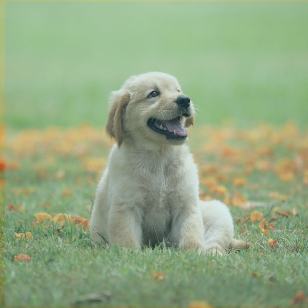
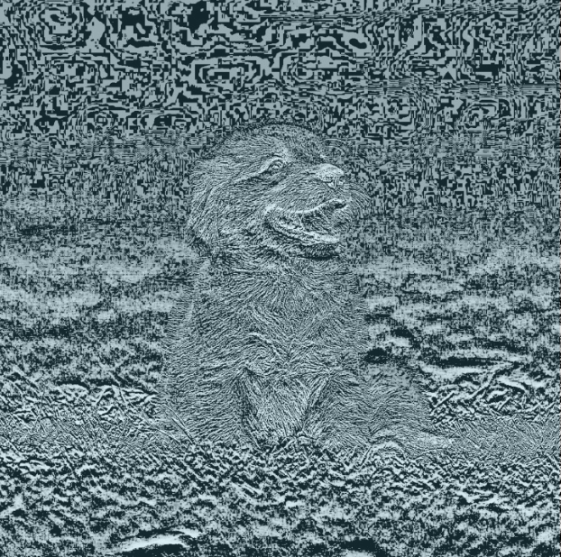
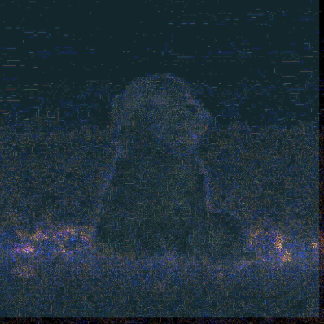
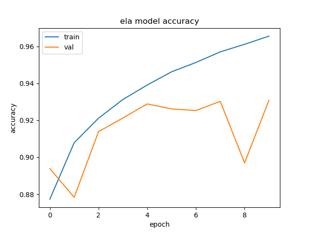
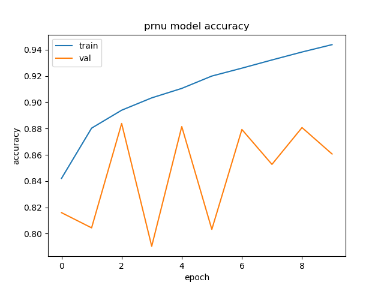

# ai-image-detection

**Project Overview**

This program utilizes CNNs with the TensorFlow library to determine whether or not an image is real or AI-Generated using two pixel-wise feature extraction techniques, ELA (Error Level Analysis) and PRNU (Photo Response Non-Uniformity). The model was trained on a dataset called CIFAKE which is made up of 100,000 images for training (50,000 real and 50,000 fake), as well as 20,000 images for testing (10,000 real and 10,000 fake). I set up a simple web interface where a user can upload an image and let the model predict whether it is real or fake. This is done with a flask backend to pass the image to the saved model after it has been trained. This project is based on the research done in the following paper: https://www.ncbi.nlm.nih.gov/pmc/articles/PMC10674908/.

**ELA Specifics**

One of the pixel-wise feature extraction techniques utilized for this project was ELA or Error Level Analysis. ELA is usually used to detect image editing, as when real photos are compressed, there should be gradual losses of detail reflecting the slight degradation of data. Since AI-generated images result from training on large datasets of real photographs, they should display abnormal shifts when ELA is performed. Below is a side by side of a real image before and after ELA. 

**PRNU Specifics**

PRNU, or Photo Response Non-Uniformity, arises from the noise patterns in cameras. Due to the impossible task of translating exactly what the eyes see to a real photograph, imperfections in cameras will result in a unique noise pattern. Because AI images do not come from a real camera, the PRNU pattern should not be rather inconsistent and unidentifiable. The PRNU pattern can be found by denoising the image and then subtracting it from the original image.

**Accuracy**

**Dataset Citations:**

Krizhevsky, A., & Hinton, G. (2009). Learning multiple layers of features from tiny images.

Bird, J.J. and Lotfi, A., 2024. CIFAKE: Image Classification and Explainable Identification of AI-Generated Synthetic Images. IEEE Access.
